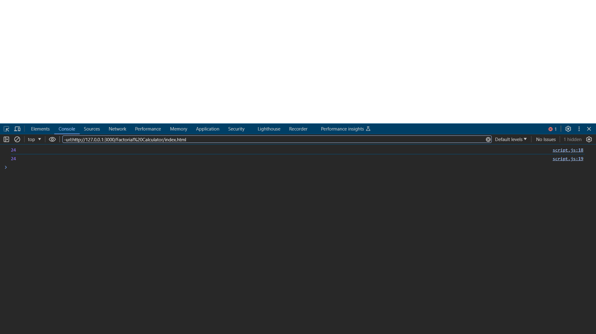

# Factorial Calculator

This is a simple factorial calculator implemented in HTML and JavaScript.

## Screenshot

## Usage

To use this calculator, simply open the HTML file in your browser and check the console for the output.